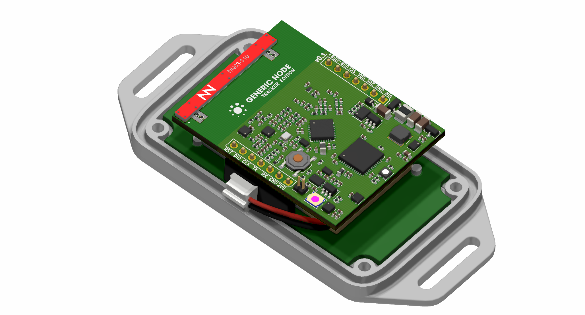
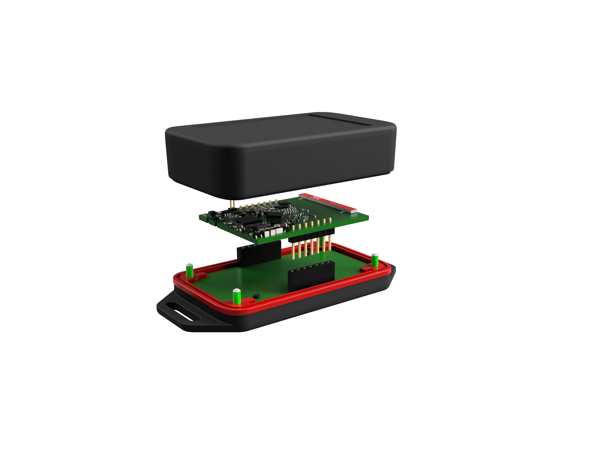

# Generic Node Tracker Edition (GNTE)

## About

The Generic Node Tracker Edition provides a reference HW design that features [Semtech LR1110](https://www.semtech.com/products/wireless-rf/lora-edge/lr1110) modem and an STM32L073 host MCU.

This repository contains all the necessary hardware and software files for the GNTE node.

## Documentation

The [Generic Node documentation website](https://www.genericnode.com/docs/) provides information about the node hardware and software features.

## Acknowledgment

The [Software](./Software) featured in this repository is a fork of Semtech [lr1110_modem_application_example](https://github.com/Lora-net/lr1110_modem_application_example) with minor changes that reflect the HW design.

## Legal

Copyright © 2021 The Things Industries B.V.

[Contact The Things Industries](https://thethingsindustries.com/contact/) for licensing.
